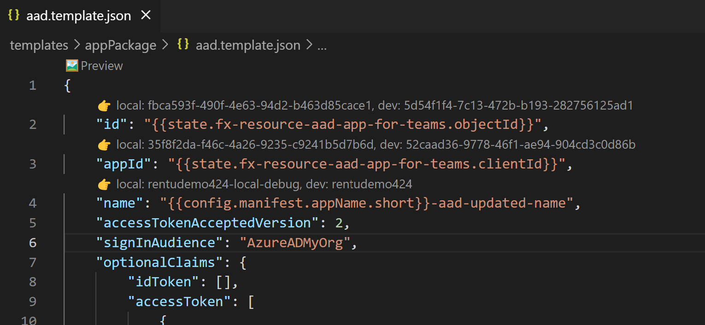
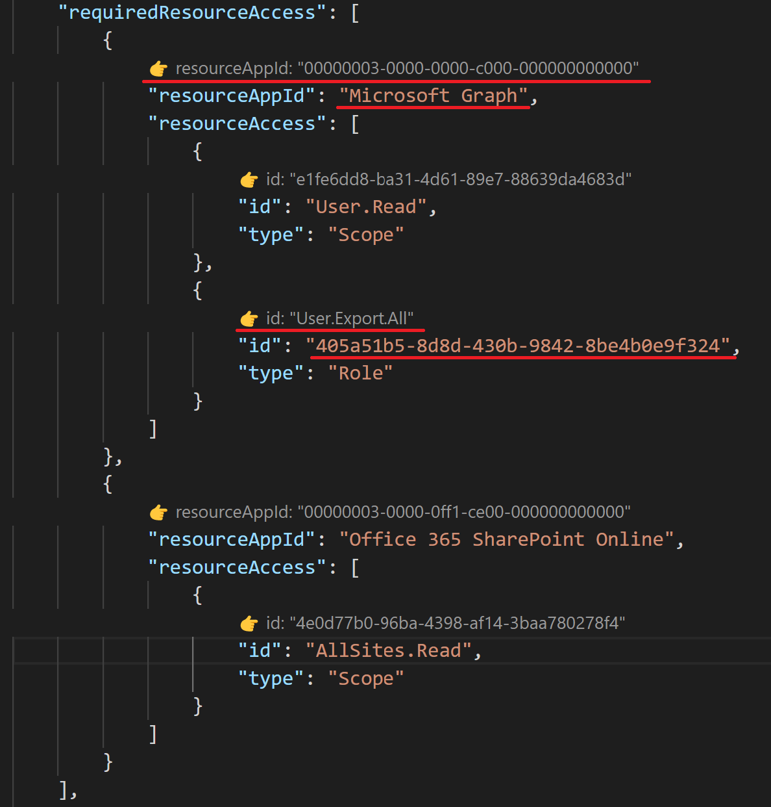

## AAD manifest introduction

The AAD manifest contains a definition of all the attributes of an AAD application object in the Microsoft identity platform. There is a [document](https://docs.microsoft.com/en-us/azure/active-directory/develop/reference-app-manifest) to introduce AAD manifest schema and definitions. You can also find AAD manifest from AAD application page on Azure Portal.

Before enabling AAD manifest features in Teams Toolkit extension, AAD application is created/update by the extension, and users can only modify/update AAD application from Azure portal, and some update may conflict with extension. With the latest version of Teams Toolkit extension, we added AAD manifest build-in support in the extension, which make it easier for user to customize AAD application.

## AAD manifest in VSCode Teams Toolkit extension

When create app using Teams Toolkit with SSO support, or after adding SSO support in a non-SSO project, AAD manifest template will be added to `templates\appPackage\aad.template.json`. Extension will use this AAD manifest template file to create/update AAD application for these scenarios:

### AAD manifest lifecycle in F5 local debug command

1. Read `state.local.json` file to check whether AAD application for local debug has already been created, if yes then use the existing AAD application instead of creating new one.

1. If need to create a new AAD application, extension will create it using AAD manifest template file, and for some properties which required additional context (such as `replyUrls` property need to know current local debug endpoint), it will ignore it during this creating stage.

1. After local dev environment startup successfully, update AAD application's `identifierUris`, `replyUrls` and other properties which are not available during create stage according to local dev environment endpoint.

### AAD manifest lifecycle in provision command

1. Read `state.xxx.json` file to check whether AAD application for the environment has already been created, if yes then use the existing AAD application instead of creating a new one.

1. If need to create a new AAD application, extension will create it using AAD manifest template file, and for some properties which required additional context (such as `replyUrls` property need to know frontend or bot endpoint), it will ignore it during this creating stage.

1. After other resources have successfully provisioned, update AAD application's `identifierUris` and `replyUrls` according to frontend hosting / bot endpoint.

### AAD manifest lifecycle in Deploy command

1. `Deploy resource to cloud` command will not handle AAD application, you need to use `Deploy Azure Active Directory app manifest` instead if you want to update AAD application
1. `Deploy Azure Active Directory app manifest` will update the AAD application according to the AAD manifest template file, if current environment hasn't provisioned and AAD application is not existed, it will throw errors. If your project has already been provisioned and you want to update your AAD application, you can use this command.

After the AAD application has successfully deployed, you can follow steps below to find the AAD app: 

#### How to view AAD app on Azure portal
1. Copy AAD app client id from `state.xxx.json` (xxx is the environment name that you have deployed the AAD app) file in `fx-resource-aad-app-for-teams` property.

1. Go to Azure portal and login your M365 account which used for the Teams app.

1. Open [app registrations page](https://portal.azure.com/#blade/Microsoft_AAD_IAM/ActiveDirectoryMenuBlade/RegisteredApps), search the AAD app using client id which copied from step 1.

1. If everything works fine, you can find your AAD app.

## Placeholders in AAD manifest template

AAD manifest file contains placeholder arguments with `{{...}}` statements which will be replaced at build time according to different environment. Placeholder argument supports config file, state file and environment variables.

### Referencing state file values in AAD manifest template

State file is located in `.fx\states\state.xxx.json` (xxx is represent different environment). A typical state file is as below:

```json
{
    "solution": {
        "teamsAppTenantId": "uuid",
        ...
    },
    "fx-resource-aad-app-for-teams": {
        "applicationIdUris": "api://xxx.com/uuid",
        ...
    }
    ...
}
```

If you want to reference `applicationIdUris` value in `fx-resource-aad-app-for-teams` property, you can use this placeholder argument in the AAD manifest: `{{state.fx-resource-aad-app-for-teams.applicationIdUris}}`

### Referencing config file values in AAD manifest template

Config file is located in `.fx\configs\config.xxx.json` (xxx is represent different environment). A typical config file is as below:

```json
{
  "$schema": "https://aka.ms/teamsfx-env-config-schema",
  "description": "description.",
  "manifest": {
    "appName": {
      "short": "app",
      "full": "Full name for app"
    }
  }
}
```

If you want to reference `short` value, you can use this placeholder argument in the AAD manifest: `{{config.manifest.appName.short}}`

### Referencing config file values in AAD manifest template

Some times you may not want to hardcode the values in AAD manifest template. For example, when the value is a secret. AAD manifest template file supports referencing the values from environment variables. You can use syntax `{{env.YOUR_ENV_VARIABLE_NAME}}` in parameter values to tell the tooling that the value needs to be resolved from current environment variable.

## AAD manifest authoring supports

AAD manifest template file has codelens to help you better reviewing and editing it.



### Preview codelens

At the beginning of the AAD manifest template file, there is a preview codelens. Click this codelens, it will generate AAD manifest based on the environment you selected.


### Placeholder argument codelens

Placeholder argument has codelens to help you take quick look of the values for local debug and develop environment. If your mouse hover on the placeholder argument, it will show tooltip box for the values of all the environment.


### Required resource access codelens

Different from official [AAD manifest schema](https://docs.microsoft.com/en-us/azure/active-directory/develop/reference-app-manifest) that `resourceAppId` and `resourceAccess` id in `requiredResourceAccess` property only support uuid, AAD manifest template in Teams Toolkit also support user readable strings for `Microsoft Graph` and `Office 365 SharePoint Online` permissions. If you input uuid, codelens will show user readable strings, otherwise, codelens will show uuid.



### Pre-authorized applications codelens

For `preAuthorizedApplications` property, codelens will show the application name for the per-authorized application id.

## Customize AAD manifest template

User can customize AAD manifest template to update AAD application.

### Customize requiredResourceAccess

If your Teams app required more permissions to call API with additional permissions, you need to update `requiredResourceAccess` property in the AAD manifest template. Here is an example for this property:

```json
"requiredResourceAccess": [
    {
        "resourceAppId": "Microsoft Graph",
        "resourceAccess": [
            {
                "id": "User.Read", // For Microsoft Graph API, you can also use uuid for permission id
                "type": "Scope" // Scope is for delegated permission
            },
            {
                "id": "User.Export.All",
                "type": "Role" // Role is for application permission
            }
        ]
    },
    {
        "resourceAppId": "Office 365 SharePoint Online",
        "resourceAccess": [
            {
                "id": "AllSites.Read",
                "type": "Scope"
            }
        ]
    }
]
```

`resourceAppId` property is for different APIs, for `Microsoft Graph` and `Office 365 SharePoint Online`, you can input the name directly instead of uuid, and for other APIs, you need to use uuid.

`resourceAccess.id` property is for different permissions, for `Microsoft Graph` and `Office 365 SharePoint Online`, you can input the permission name directly instead of uuid, and for other APIs, you need to use uuid.

`resourceAccess.type` property is used for delegated permission or application permission. `Scope` means delegated permission and `Role` means application permission.

### Customize preAuthorizedApplications

You can use `preAuthorizedApplications` property to authorize a client application indicates that this API trusts the application and users should not be asked to consent when the client calls this exposed API.
Here is an example for this property:

```json
    "preAuthorizedApplications": [
        {
            "appId": "1fec8e78-bce4-4aaf-ab1b-5451cc387264",
            "permissionIds": [
                "{{state.fx-resource-aad-app-for-teams.oauth2PermissionScopeId}}"
            ]
        }
        ...
    ]
```

`preAuthorizedApplications.appId` property is used for the application you want to authorize. If you doesn't know the application id but only knows the application name, you can go to Azure Portal following this steps to search the application to find the id:

1. Go to [Azure Portal and open app Registrations](https://portal.azure.com/#blade/Microsoft_AAD_IAM/ActiveDirectoryMenuBlade/RegisteredApps)

1. Click `All applications` and search the application name

1. If you find the application that you search for, you can click the application and get the application id from the overview page

### Customize redirect URLs

Redirect URLs is used when returning authentication responses (tokens) after successfully authenticating. You can customize redirect URLs using property `replyUrlsWithType`, for example, if you want to add `https://www.examples.com/auth-end.html` as redirect URL, you can add it as below:

```json
"replyUrlsWithType": [
    ...
    {
        "url": "https://www.examples.com/auth-end.html",
        "type": "Spa"
    }
]
```

## Limitations

1. Not all the properties listed in [AAD manifest schema](https://docs.microsoft.com/en-us/azure/active-directory/develop/reference-app-manifest) are supported in Teams Toolkit extension, this tab show the properties that are not supported:

    | Not supported properties   | Reason                     |
    | -------------------------- | -------------------------- |
    | passwordCredentials        | Not allowed in manifest    |
    | createdDateTime            | Readonly and cannot change |
    | logoUrl                    | Readonly and cannot change |
    | publisherDomain            | Readonly and cannot change |
    | oauth2RequirePostResponse  | Doesn't exist in Graph API |
    | oauth2AllowUrlPathMatching | Doesn't exist in Graph API |
    | samlMetadataUrl            | Doesn't exist in Graph API |
    | orgRestrictions            | Doesn't exist in Graph API |
    | certification              | Doesn't exist in Graph API |

1. Currently `requiredResourceAccess` property can use user readable resource app name or permission name strings only for `Microsoft Graph` and `Office 365 SharePoint Online` APIs. For other APIs, you need to use uuid instead. You can follow these steps retrieve ids from Azure Portal:

    1. [Register a new AAD application](https://portal.azure.com/#blade/Microsoft_AAD_IAM/ActiveDirectoryMenuBlade/RegisteredApps) on Azure Portal.
    1. Click `API permissions` from the AAD application page.
    1. Click `Add a permission` to add the permission you want.
    1. Click `Manifest`, from the `requiredResourceAccess` property, you can find the ids of API and permissions.


