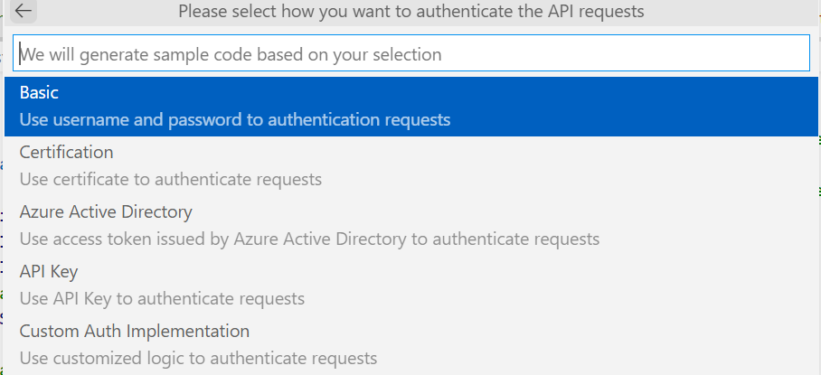

> The content is under construction and is subject to change in the future.

If you want to make http(s) requests to an API that is not part of your project and do not have appropriate SDK, you could leverage this feature to bootstrap some code which handles authentication for your API requests automatically. If you already have SDK for target API, it's suggested to use SDK in your code.

# How to use this feature

The feature is available in VS Code Teams Toolkit and TeamsFx CLI.

## Use this feature in VS Code Teams Toolkit
1. Open a TeamsFx project, press `Ctrl + Shift + P` to open command palatte and choose command `Teams: Connect to an API`
    
2. Input endpoint for your API. The endpoint should be a valid http(s) url. It will be added to your project's local app setting and used as base url when making requests. This means you don't need to input full api url for every request.
    
3. Choose which component needs to invoke the API. We will make following changes to the selected component:
    * Generate sample code under component root folder
    * Add appropriate version of `@microsoft/teamsfx` package to package.json if you don't have this package in your component
    * Add new app settings for your API to `.env.teamsfx.local`, which is used during local debugging
    
4. Input alias for your API. The alias is used to generate app setting names for your API, which will be added to your project's local app setting.
    
5. Select how you want to authenticate the API requests. We will generate appropriate sample code and add corresponding local app settings based on your selectiong.
    
6. There will be some additional questions for your selected auth type. Provide information each question to complete the command.

## Use this feature in TeamsFx CLI

The base command of this feature is `teamsfx add api-connection [authentication type]`. Here is the list of available authentication type and corresponding sample command. You can use `teamsfx add api-connection [authentication type] -h` to get help document.
| Authentication type | Sample command |
| --- | --- |
| Basic | teamsfx add api-connection basic --endpoint https://example.com --component bot --alias example --user-name exampleuser --interactive false |
| API Key | teamsfx add api-connection apikey --endpoint https://example.com --component bot --alias example --key-location header --key-name example-key-name --interactive false |
| AAD | teamsfx add api-connection aad --endpoint https://example.com --component bot --alias example --app-type custom --tenant-id your_tenant_id --app-id your_app_id --interactive false |
| Certificate | teamsfx add api-connection cert --endpoint https://example.com --component bot --alias example --interactive false |
| Custom | teamsfx add api-connection cert --endpoint https://example.com --component bot --alias example --interactive false |

# How this feature changes your project

After you successfully triggered the command, the tooling will make following changes to `bot` or `api` folder based on selected component(s):
1. Generate `{your_api_alias}.js/ts`. The file demostrates how to initialize an API client for your API with support of `@microsoft/teamsfx` package, as well as exported the API client to be consumed in other source code files.
2. Add `@microsoft/teamsfx` package to `package.json` if your project does not have this package. The package provides support for common API authentication methods.
4. Add several environment variables to `.env.teamsfx.local` to provide necessary information for selected authentication type. The generated code will read values from these environment variables. You can rename the environment variables and update generated code to use your favorite names.

# Next steps after you ran the command

After the command updated your project, please follow the instructions displayed by the tooling to invoke your APIs. Generally, you need to do following things. You can visit the generated file to get more details for these action items.

## 1. Run npm install
You need to run `npm install` under `bot` or `api` folder to install added packages. This ensures you can have Intellisense support when coding.

## 2. Add your API credentials to local app settings
The command will not ask any credentials when generating sample code and adding local app settings. But it will leave some placeholders for you to fill your credentials. Please fill your API credentials to `.env.teamsfx.local` under `bot` or `api` folder to avoid authentication failures for your API requests.

## 3. Reference the generated API client
The sample code initializes an API client instance for you and exports it. So in your source code, you can import the API client instance and use it:
``` ts
import { yourApiClient } from '{relative path to the generated file}'
```

## 4. Make http(s) requests to target API (with axios)
The generated API client is an axios instance. [Axios](https://www.npmjs.com/package/axios) is a popular nodejs package that helps you making http(s) requests. You can visit https://axios-http.com/docs/example to learn how to make http(s) requests with it.

## 5. Add app settings for your hosting environments
The command only setups app settings for your local environment to help you debugging your code. Before you deploy your code to your hosting environments, you need to add necessary app settings to your hosting environments. The sample code contains comments that tell you what app settings you need to configure.

If you're using Azure to host your application, you can visit https://aka.ms/teamsfx-add-appsettings to learn how to add app settings.

# Advanced scenarios

## Custom authentication provider
Besides the authentication provider included in `@microsoft/teamsfx` package, you can also implement your customized authentication provider that implements `AuthProvider` interface and use it in `createApiClient(..)` function:
``` ts
import { AuthProvider } from '@microsoft/teamsfx'

class CustomAuthProvider implements AuthProvider {
    constructor() {
        // You can add necessary parameters for your customized logic in constructor
    }

    AddAuthenticationInfo: (config: AxiosRequestConfig) => Promise<AxiosRequestConfig> = async (
        config
    ) => {
        /*
        * The config parameter contains all the request information and can be updated to include extra authentication info.
        * Refer https://axios-http.com/docs/req_config for detailed document for the config object.
        * 
        * Add your customized logic that returns updated config
        */
    };
}
```